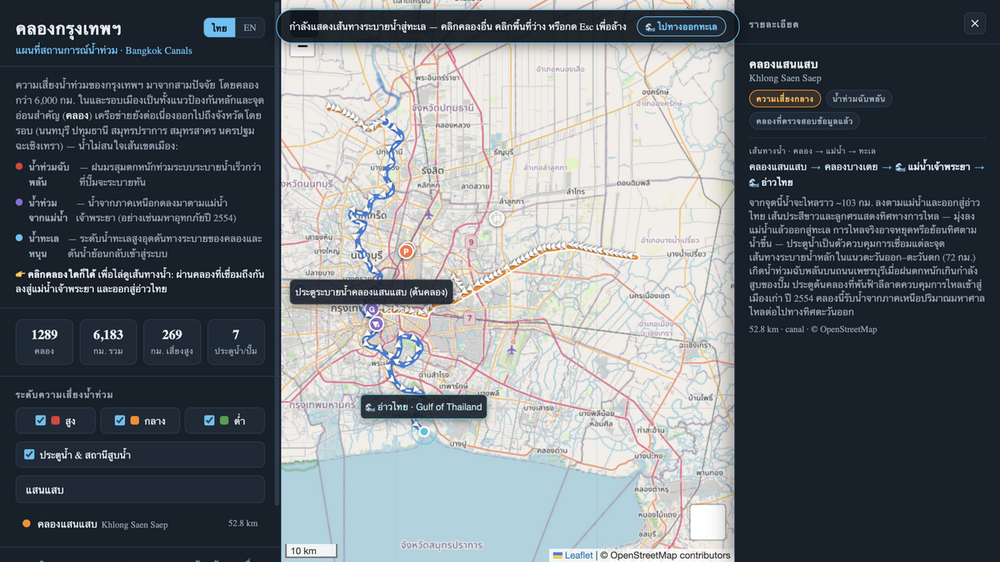

# Bangkok Canals — Flood Situation Map

An interactive map of Bangkok's canal (*khlong*) network, colored by each
canal's current water-level status (BMA telemetry, classified like
flood69.peoplesparty.or.th: วิกฤต / เตือนภัย / ปกติ / น้ำต่ำ), to help
understand how the city floods and where.



## Run it

```bash
python3 -m http.server 8420
# open http://localhost:8420
```

(Any static file server works. Opening `index.html` directly also works;
only the basemap tiles need internet.)

## What it shows

- **1,454 named canals** (6,146 km) — Bangkok plus the canal network of the
  surrounding provinces (Nonthaburi, Pathum Thani, Samut Prakan, Samut Sakhon,
  Nakhon Pathom, Chachoengsao). Only canals connected to the Bangkok network are
  shown; far unlinked channels are dropped at build time. Khlong names that
  repeat across provinces (e.g. two different *Khlong Bang Toei*) are split into
  separate features at build time, so a river contact in one province can no
  longer claim a same-named canal elsewhere.
- **Bilingual UI — Thai by default** — the whole interface (intro, filters,
  stats, canal list, search, trace banner, detail panel, map tooltips) is in
  Thai; the ไทย / EN toggle in the sidebar header switches to English instantly
  (canal names, reviewed notes, structure notes, and labels included), and the
  choice persists in `localStorage`. Canal names carry both languages
  (`name` / `name_th`) and reviewed canals have notes in both (`note` /
  `note_th`), so nothing is lost in either language.
- **Live-status coloring & filters** — every canal line is coloured by its
  **current water status**, classified exactly like
  [flood69.peoplesparty.or.th](https://flood69.peoplesparty.or.th) (the People's
  Party mirror of BMA's KlongMap): red = **วิกฤต critical** (above the critical
  bank threshold), orange = **เตือนภัย warning** (above the warning threshold),
  green = **ปกติ normal**, light blue = **น้ำต่ำ low water** (below the dry
  threshold, merged in from the flood69 mirror by station code); canals without
  a reporting station stay grey. The sidebar filters switch these four statuses
  (canals without live data always stay on), with the risk *driver* still tagged
  on reviewed canals: *flash flood* (monsoon rain), *riverine* (Chao Phraya
  flood from the north), *tidal* (sea blocking outflows), or *mixed*
- **30+ reviewed corridors** drawn bold, with notes on documented flood history
  (2011 river flood, chronic monsoon flash-flood spots, tidal backflow)
- **Live water levels** — a snapshot of BMA Drainage & Sewerage Department
  telemetry (300+ stations on Bangkok's canals, retention ponds and river),
  mapped onto the canal network. Canals with a station show their current status
  (critical / warning / normal / low water / station fault), the reading in
  m (MSD) against the warning, critical and low-water thresholds, and the
  individual stations; the sidebar shows citywide station counts plus **when the data is
  from** — both the latest station reading and when the snapshot was fetched —
  and every detail panel repeats the reading time of that canal's stations.
  Refresh with `node fetch_live.mjs` (see *Rebuilding the data*). The detail
  panel shows the canal's current status as a badge; every canal line
  is coloured by its current status — selected or not, so clicking a canal
  never changes its colour — and grey only where no station reports.
- **Live-situation glow** — canals whose stations currently read above their
  bank thresholds glow underneath their current-status colour (bright red =
  critical, orange = warning), with a sidebar filter to toggle it. The glow is
  pure emphasis: it keeps a canal in flood visible among the thinner lines.
- **Chao Phraya tides** — today's two high / two low tides (m MSD) in the
  sidebar, with the next tide highlighted; fetched via
  `node fetch_flood69.mjs` (see *Rebuilding the data*).
- **Drainage-path tracing to the sea** — click any canal and the map highlights
  it, dims everything else, and draws an animated path (white dashes plus
  direction arrows pointing downstream) through every connected canal until it
  reaches the Chao Phraya,
  then continues along the river all the way to the river mouth on the **Gulf
  of Thailand**, ending at a pulsing sea marker. The popup lists the full chain
  (canal → … → 🌊 Chao Phraya → 🌊 Gulf of Thailand) and the river distance to
  the sea; the "🌊 to the sea" button on the trace banner flies to the mouth.
  The canal trace is built from a canal-connectivity graph (shared endpoints +
  line crossings, ~20 m tolerance) computed at build time, and the route to the
  river is chosen by **least along-canal distance** (Dijkstra), so water is
  routed out through the geographically nearest real mouth rather than the
  fewest hops; the river walk links
  the Chao Phraya's OSM ways into an ordered downstream chain whose southernmost
  vertex is the mouth on the coastline. Clicking a canal (or a gate/pump marker)
  opens a **detail panel on the right** with the full chain (canal → … →
  🌊 Chao Phraya → 🌊 Gulf of Thailand) and the river distance to the sea; the
  "🌊 to the sea" button on the trace banner flies to the mouth. ~93% of canals
  reach the river in the mapped network, the rest are reported as isolated.
  `audit_connections.mjs` dumps every key corridor's links + displayed chain and
  `audit_trace.mjs` cross-checks all 1,450+ routes network-wide.
- **Gates & pumping stations** — key flood-control structures
- **Location lookup ("which canals connect here?")** — enter coordinates (lat,lng
  or a pasted Google Maps link), press 📍 and click the map, or use the browser's
  own location: a pin is dropped and every canal within the search radius is
  highlighted (the rest dimmed) — the radius is adjustable from 200 m to 5 km
  in the sidebar and the choice persists. The panel lists each nearby canal
  with its direct junctions — every junction is clickable and opens the full
  drainage trace — plus any gates / pumping stations within reach; the dropped
  pin stays on the map while you explore traces. A **เลือกคลองทั้งหมด (select
  all)** checkbox above the list puts every canal found inside the radius into
  the multi-selection at once — stacked drainage traces and all (off by default;
  a new search resets it). Rows carry the same live-status
  chip as the main list, and canals inside the radius keep
  their live colour while above the warning or critical bank level.
- Searchable canal list, live-status filters (วิกฤต / เตือนภัย / ปกติ / น้ำต่ำ), base-map switcher

## Canal knowledge wiki (for AI agents)

[`wiki/`](wiki/README.md) holds a sourced, machine-readable knowledge base of Bangkok's canal
network — per-canal entries with **flow direction & control mechanisms** (tides / gates /
pumps), connectivity, coordinates, confidence ratings and explicit
verified-vs-inferred-vs-not-found labels, plus a cross-check of the curated notes above
([wiki/map-corrections.md](wiki/map-corrections.md)). Start at [wiki/README.md](wiki/README.md);
`wiki/hydrology.md` explains why canal flow directions here are operational, not fixed.

## Data & disclaimers

- Canal geometry: © [OpenStreetMap](https://www.openstreetmap.org) contributors,
  fetched via Overpass API — Bangkok admin boundary (TH-10) plus a ring over the
  surrounding provinces; the build keeps only canals in a connected component
  that contains a Bangkok canal (key snapshot in `data/bangkok_keys.json`).
  Chao Phraya centerline fetched the same way as the drainage sink.
- Live water levels: © Bangkok Metropolitan Administration, Drainage and
  Sewerage Department telemetry — <https://weather.bangkok.go.th/water>
  (Summary page as the primary feed, the KlongMap map endpoint as fallback).
  BMA's WAF answers HTTP 429 when the endpoints are polled too hard — when it
  does, the flood69 mirror below (which mirrors BMA's own KlongMap data)
  supplies the readings instead.
  Stations attach to canals by name (`river_name` → the canal's Thai/English
  name), with a nearest-canal fallback within 200 m for stations whose canal
  isn't named in OSM (shown as "nearby station" in the UI). ~288 of ~312
  stations map onto 150+ canals; retention ponds and ditches off the network
  only count toward the citywide totals.
- Water statuses (วิกฤต / เตือนภัย / ปกติ / น้ำต่ำ) are **telemetry readings at
  the snapshot time**, not a warning service: "critical" means the water had
  passed the BMA's critical bank level for that canal when it was read, and
  "low water" means it sat below the BMA's dry threshold (a condition you only
  see in the dry season). The classification mirrors
  flood69.peoplesparty.or.th level-for-level; the flood69 mirror is also the
  only feed carrying the dry threshold. Each station's snapshot record flags
  whether the computed status agrees with BMA's own reported flood status.
  For live flood warnings use BMA /
  Thai Government official channels.
- The trace shows the **drainage route** toward the river and out to the Gulf;
  actual flow direction can pause or reverse with the tide, and gates control
  each connection.
- Some gate/pump marker positions are approximate (flagged in their popups).

## Rebuilding the data

One command refreshes everything (geometry + live water levels), then just
reload the page:

```bash
./update_data.sh              # full update: OSM geometry + BMA live readings
./update_data.sh --live-only  # just the live readings (quick, the usual choice)
```

The script ends with a summary of exactly what the site will show — station
counts, the latest reading, and the snapshot time ("อ่านค่าล่าสุด" /
"ดึงข้อมูลเมื่อ"). If the BMA endpoint hiccups, the site keeps using the
previous snapshot; the sidebar always shows how old it is.

Under the hood this runs:

```bash
node build_data.mjs    # OSM geometry → data/canals_data.js
node fetch_live.mjs    # BMA telemetry → data/live_status.js (the site's live layer + timestamps)
node fetch_flood69.mjs # BMA tides via flood69 → data/flood69.js (sidebar tide block)
```

`build_data.mjs` merges OSM way segments into named canals, simplifies lines
(Douglas-Peucker), computes lengths, and attaches the curated risk table
(`CURATED` in the script). Edit the curated entries there to refine ratings.

`fetch_live.mjs` synthesizes one record per station from three feeds keyed by
station code, then maps them onto the canal network and writes
`data/live_status.js`. The **primary source** is BMA's own Summary page
(`GET weather.bangkok.go.th/water/Summary`, which embeds a 304-station JSON
array with clean levels, warning/critical thresholds, bank levels, daily maxima
and RTU device health). The **flood69 mirror** is overlaid for everything the
Summary page lacks — the low-water threshold (`dry_in` + `checkdry`) and
pump/gate activity — and covers the stations the Summary page doesn't carry;
since October 2026 BMA's KlongMap feed nests the live reading (`wl_in`,
`site_timestamp`, `max_in_day`) inside a `water_level_last` object instead of
the station record, and the script accepts either shape. When BMA's WAF
rate-limits (HTTP 429 — it does if polled more often than about every half
hour) the script skips the remaining BMA calls for the run and rebuilds the
whole snapshot from the flood69 mirror: same stations, levels and thresholds,
minus the device-health fields only the Summary page carries. If a run comes
back without a single parseable reading, the previous snapshot is kept
untouched rather than overwritten with an all-faulty map. BMA's old map endpoint
(`POST weather.bangkok.go.th/water/PageMap/GoogleMap` — it 403s without a
session cookie and a browser User-Agent, and sends no CORS headers, which is
why the site ships a generated snapshot instead of fetching live) remains the
last resort for codes absent from both. Statuses follow flood69's algorithm:
level < dry threshold → dry, ≥ critical → critical, ≥ warning → warning, else
normal; stations with tripped telemetry (breaker / RTU door) or no reading are
faulty. Each station also records `status_agrees` — whether the computed status
matches BMA's reported `water_status_flood` (1=normal 2=warning 3=critical);
the computed status stays authoritative when they differ. Re-run it whenever
you want fresher readings (space runs at least ~30 minutes apart, or the WAF
will throttle the endpoint for everyone) — the sidebar always shows how old the
snapshot is.

`fetch_flood69.mjs` adds today's Chao Phraya tide prediction (two high / two
low tides, m MSD) to the sidebar. It reads the People's Party flood portal
(`flood69.peoplesparty.or.th/api/klongmap`, with the portal's own static
snapshot as fallback) — a 5-minute-cache mirror of BMA's KlongMap schematic
(`weather.bangkok.go.th/KlongMap`). This is also where `fetch_live.mjs` gets
the low-water threshold for the น้ำต่ำ status; this script itself only uses
the `dailyheightwater` tide table. A failure there doesn't abort the update —
the site just keeps showing
the previous tide snapshot. Don't run it more often than needed: the portal
caches upstream precisely to spare BMA's system.
